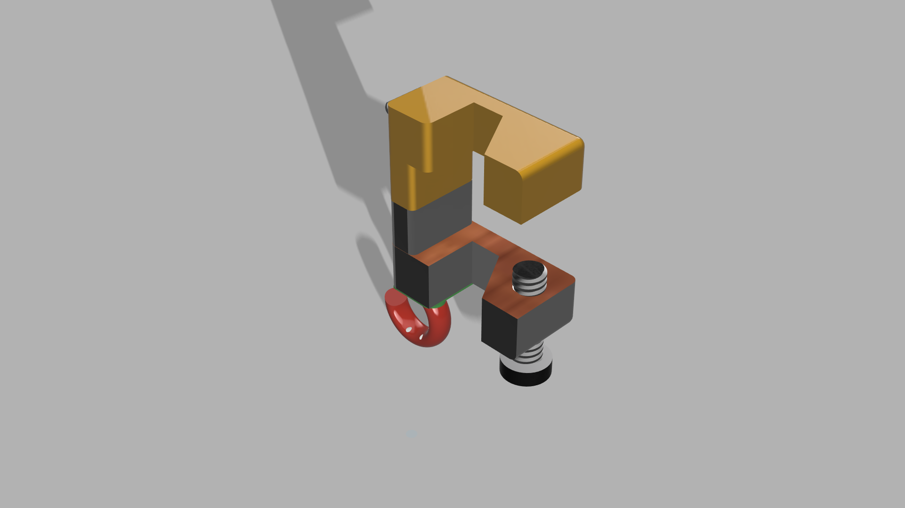
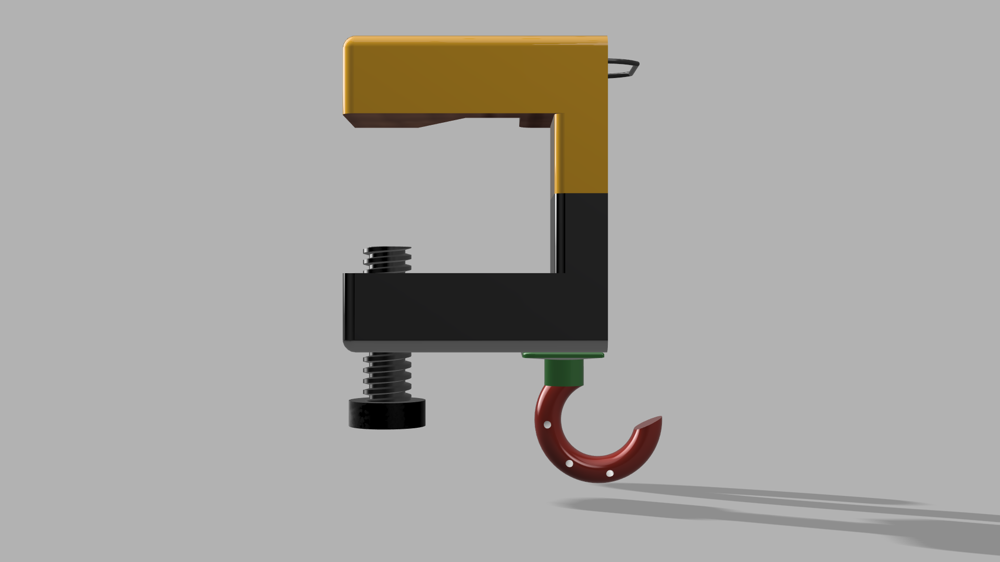
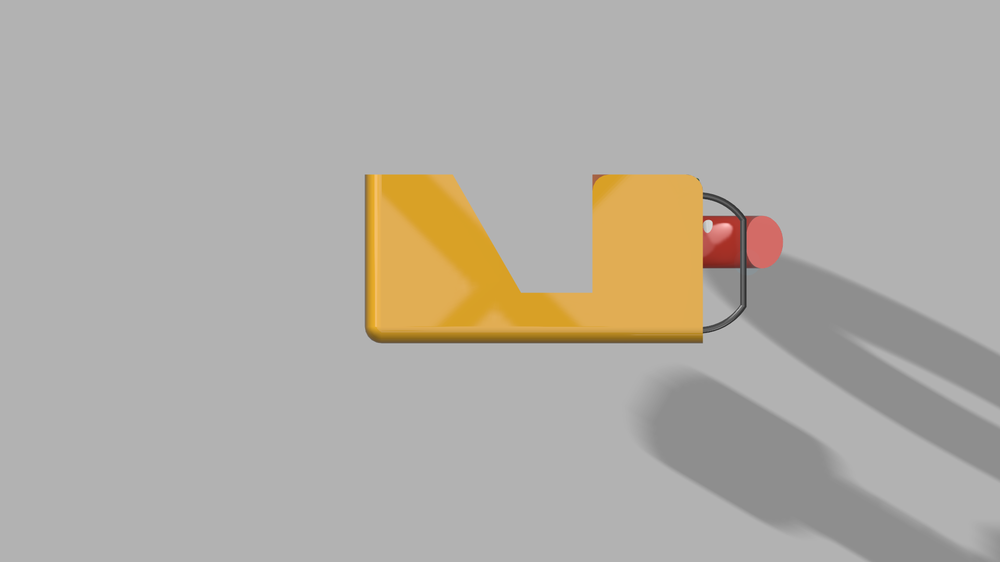

# Multipurpose Table Clamp

A 3D-printed mechanical clamp with multiple functions: bag hook, phone stand, and bottle opener. Designed and prototyped as a hackathon solution to solve real-world canteen problems at GTU (Gujarat Technological University).

**Status:** Designed & prototyped | **Material:** PLA | **Tool:** Autodesk Fusion 360 | **Year:** September 2019

## Problem Statement

At the GTU canteen, students faced a recurring challenge: nowhere clean to store personal items while eating. The floor was dirty, and leaving a bag on it meant it would get soiled. A simple hook or attachment point on the table could solve this — but why make it single-function?

## Solution

A compact C-clamp that mounts to any table edge and serves three purposes:

1. **Bag Hook** — Hangs bags, watches, and personal items off the table surface (keeping them off dirty floors)
2. **Phone Stand** — Notch holds a smartphone upright at a comfortable viewing angle
3. **Bottle Opener** — Horseshoe-shaped hook at the bottom can open bottles

All in one compact, printed part.

## Technical Highlights

### Design for Additive Manufacturing (DfAM)

The clamp demonstrates intentional DfAM principles:

- **Printed threads:** The clamp bolt and nut are designed with integrated threads, printed as a single assembly. This eliminates the need for metal hardware and showcases the capability of FDM printing to create functional mechanical interfaces.
- **Compact geometry:** All three functions fit within 60 × 50 mm, optimized for efficient print time and material use.
- **Strength through design:** Strategic thickness variations in the clamp body and jaw distribute stress without unnecessary bulk.

### Components

- **Clamp body** (yellow/gold) — C-clamp profile with notch for phone mounting
- **Sliding jaw** (grey) — Movable lower arm tightens against the table edge
- **Printed bolt & nut** (black) — Tightening mechanism with integrated threads
- **Bag hook** (red horseshoe) — Mounted at the bottom via connector
- **Phone slot notch** — Integrated into upper body design

### Specifications

| Parameter | Value |
|-----------|-------|
| Footprint | 60 × 50 mm approx. |
| Material | PLA |
| Printer | Prusa Tarantula |
| Wall thickness | 2-3 mm |
| Number of parts | 3 (body, jaw, bolt/nut assembly) |
| Team size | 3 |

## CAD Renders

Isometric views of the fully assembled design showing all functional components:

*Full assembly — C-clamp profile with phone slot and hook attachment points visible*

*Front view — hook position clearly shown for bag hanging*

*Top view — phone slot notch and bottle opener hook placement*

## Prototype & Testing

The design was successfully printed on a Prusa Tarantula printer and tested in real-world conditions:

*Prusa Tarantula in action — printing the clamp on PLA material*

*Completed print showing the threaded bolt and overall assembly*

*Close-up of the screw mechanism and hook connector*

*Functional test — smartphone mounted securely in the clamp notch*

## Design Philosophy

This project applies three key principles:

1. **Real-world problem-solving** — Identified a genuine need in the canteen and designed a practical solution
2. **Multi-functionality** — Maximized utility in minimal form factor; one device, three uses
3. **Additive manufacturing optimization** — Leveraged 3D printing to create a single-piece assembly with integrated mechanical features (printed threads) that would be difficult or impossible to manufacture traditionally

## Files Included

- `clamp_assembly.step` — Complete assembly file (Fusion 360 export) — CAD model for reference and further iteration
- `glove_body_dispenser.step` — Main clamp body component

## Getting Started

1. **View the design:** Open the STEP files in Fusion 360, FreeCAD, or any STEP viewer
2. **Print:** Export to STL format and slice on your preferred slicer (Cura, PrusaSlicer). Recommended settings:
   - Layer height: 0.2 mm
   - Infill: 20% (gyroid or grid)
   - Support: Required for the hook arm and notch
   - Print time: ~4–6 hours depending on scale
3. **Assemble:** Print as separate parts (body, jaw, bolt assembly) and press-fit together
4. **Test:** Clamp to table edge and verify all three functions

## Team

Designed and prototyped by a team of three mechanical engineering students at GTU during a hackathon event, September 2019. All team members contributed across CAD modeling, design iteration, and physical testing.

## License

MIT License — feel free to modify and reprint

## Context

This project was completed as part of a hackathon focused on practical product design. It represents the intersection of real-world observation, creative problem-solving, and hands-on prototyping. The emphasis on DfAM principles reflects an understanding that 3D printing enables designs that traditional manufacturing cannot easily achieve.

---

**Questions?** This project demonstrates competency in CAD modeling, design for manufacturing, and iterative prototyping. Improvements in future iterations might include:
- Refined print orientation for strength
- Tolerance testing on various table thicknesses
- Ergonomic redesign of the phone slot
- Alternative materials (PETG for improved strength)
